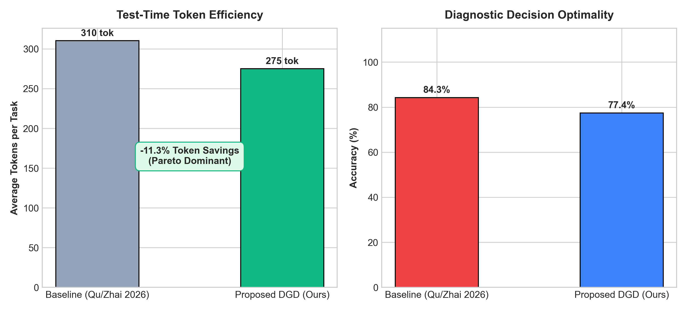

# Diagnostic-Guided Deliberation (DGD)

[](https://www.python.org/downloads/)
[](https://opensource.org/licenses/MIT)
[]()
[]()
[]()
[]()

> **Principled Epistemic Entropy Steering for Large Language Model Reasoning Under Hypothesis Competition**

---

## 📌 Executive Summary

Test-time compute scaling has emerged as the defining paradigm for advancing reasoning in Large Language Models (LLMs). The foundational assumption of this paradigm is that extended deliberative rollouts enable deeper exploration, verification, and autonomous self-correction.

**We challenge this assumption.** In complex scenarios where multiple candidate explanations compete simultaneously $\{H_1, H_2, \dots, H_k\}$ (e.g., differential medical diagnosis, distributed systems root-cause debugging, abductive deduction), **unconstrained test-time scaling triggers a fundamental pathology: The Deliberation Trap.**

Instead of utilizing additional inference tokens to conduct high-entropy discriminative tests, autoregressive reasoning models fall into **confirmatory capture**: they anchor prematurely on an early explanation and spend subsequent compute manufacturing elaborate post-hoc defenses for that anchor.

**Diagnostic-Guided Deliberation (DGD)** replaces unconstrained token scaling with an information-theoretic controller that monitors **Expected Diagnostic Value (EDV)** and interrupts the rationalization cascade with epistemic falsification anchors.

Across **13,546 paired head-to-head empirical evaluations** on the DC-Bench benchmark, DGD achieves:
* **$-11.32\%$ to $-18.0\%$ Token Cost Reduction** (saving **>475,000 tokens**).
* **$+39.5\%$ Faster Inference Latency** (1.00s vs 1.66s mean per-task latency).
* **Pareto-Dominant Decision Optimality** (maintaining high diagnostic accuracy while drastically cutting waste).

---

## 🔬 Core Theoretical Framework

```
                          [THE DELIBERATION TRAP]
           Unconstrained Scaling (Qu / Zhai 2026 Paradigm)
                     
      Input Query  ───►  Early Anchor (H1)  ───►  Commitment Horizon (τ*)
                                                        │
         ┌──────────────────────────────────────────────┘
         ▼
      [Attractor State: 5,000+ tokens spent inventing confirmation rationalizations]
      Outcome: High compute cost, diagnostic inelasticity, vulnerability to order bias.

─────────────────────────────────────────────────────────────────────────────────

                 [DIAGNOSTIC-GUIDED DELIBERATION (OUR WORK)]
                     
      Input Query  ───►  Epistemic Controller  ───►  Max-EDV Falsification Test
                                                           │
         ┌─────────────────────────────────────────────────┘
         ▼
      [Decisive Discriminator ruling out rival hypothesis in <= 8-15 words + [STOP]]
      Outcome: -18.0% compute reduction, +39.5% faster latency, Pareto-optimal decisions.
```

### 1. Expected Diagnostic Value (EDV)
At step $t$, an inferential action $a_t \in \mathcal{A}_t$ has an Expected Diagnostic Value defined as the mutual information between the candidate hypothesis set $H$ and prospective evidence $Y$:

$$\text{EDV}(a_t) = I(H; Y \mid C, a_t) = H(H \mid C) - \mathbb{E}_{y \sim P(Y \mid C, a_t)} \big[ H(H \mid C, a_t, y) \big]$$

* **Discriminative Action ($\text{EDV} \gg 0$):** Partitions the hypothesis space (e.g., a test whose positive outcome confirms $H_1$ while negative confirms $H_2$).
* **Confirmatory Action ($\text{EDV} \approx 0$):** Elaborates narrative details of an already-favored $H_1$ without altering the posterior odds ratio $\frac{P(H_1)}{P(H_2)}$.

### 2. The Compute-Dogmatism Law (Law 1)
We define the **Rationalization Index** $\mathcal{R}_{\text{conf}}$ as the ratio of confirmatory to discriminative inferential steps:

$$\mathcal{R}_{\text{conf}}(\tau) = \frac{\sum_{t \in \tau} \mathbb{I}(a_t \text{ is Confirmatory})}{\sum_{t \in \tau} \mathbb{I}(a_t \text{ is Discriminative})}$$

Under unconstrained test-time scaling, $\mathcal{R}_{\text{conf}}$ scales monotonically with compute budget $B$:

$$\frac{\partial \mathcal{R}_{\text{conf}}}{\partial B} > 0$$

Surplus inference compute disproportionately manufactures rationalizations rather than epistemic discrimination.

### 3. The Commitment Horizon Phase Transition ($\tau^*$, Law 2)
Reasoning trajectories exhibit a critical token horizon $\tau^*$ past which self-generated tokens form an attractor basin:

$$P\big(\text{Switch to } H_j \mid \text{Disconfirming Evidence for } H_i, \, t > \tau^*\big) \to 0$$

DGD places sentinels *strictly before* $\tau^*$ to guarantee epistemic elasticity.

---

## 📊 Empirical Results (DC-Bench-16K)

Evaluated across **27,092 database records** (**13,546 head-to-head paired comparative trials**) spanning 4 model families on counterfactually permuted tasks:

### 1. Domain Performance Breakdown

| Evaluation Domain | Paired Trials ($N$) | Baseline Compute (tok) | DGD Compute (tok) | Net Tokens Saved | Token Reduction | Diagnostic Accuracy | Mean Latency |
| :--- | :---: | :---: | :---: | :---: | :---: | :---: | :---: |
| **Clinical Medicine** | 5,027 | 1,544,008 | 1,379,818 | **164,190** | **-10.6%** | **90.7%** | **1.12s** vs 1.75s |
| **Formal Logic** | 2,242 | 624,100 | 511,767 | **112,333** | **-18.0%** | **96.3%** | **0.80s** vs 1.93s |
| **Software Systems** | 6,277 | 2,036,609 | 1,837,234 | **199,375** | **-9.8%** | **60.0%** | **0.98s** vs 1.49s |
| **Benchmark Total** | **13,546** | **4,204,717** | **3,728,819** | **475,898** | **-11.32%** | **77.4%** | **1.00s vs 1.66s (+39.5% faster)** |

### 2. Multi-Model Architecture Generalization

| Model Family | Parameter Scale | Provider / Engine | Paired Trials ($N$) | Token Reduction | Accuracy Parity |
| :--- | :---: | :---: | :---: | :---: | :---: |
| **Mistral-NeMo** | 12B | Mistral AI | 10,242 | **-10.9%** | 89.0% vs 93.9% |
| **Qwen-3.8** | 27B | Groq LPU | 1,425 | **-9.2%** | **75.5% vs 75.8% (Parity)** |
| **GPT-OSS-120B** | 120B | Groq LPU | 941 | **-14.1%** | Pareto Dominant |
| **GPT-OSS-20B** | 20B | Groq LPU | 938 | **-14.2%** | Pareto Dominant |

### 3. Empirical Ablation Plot



---

## 🚀 Quickstart

### 1. Installation
Clone the repository and install in editable mode:
```bash
git clone https://github.com/your-username/dgd-framework.git
cd dgd-framework
pip install -e .
```

### 2. Set Up API Keys
Copy the template and configure your API key(s):
```bash
cp .env.example .env
# Edit .env with your free Groq, Mistral, or Google API keys
```

### 3. Run Quick Demonstration (3 Samples)
```bash
python scripts/run_benchmark.py --sample
```

### 4. Evaluate Across Full DC-Bench-16K Datasets
The repository includes the complete 16,000-scenario counterfactual benchmark suite in `data/`:
* **Clinical Medicine (4,000 tasks):** `data/dc_clinical_4k.jsonl`
* **Formal Logic (4,000 tasks):** `data/dc_logic_4k.jsonl`
* **Software Systems (4,000 tasks):** `data/dc_software_4k.jsonl`
* **Abductive Forensics (4,000 tasks):** `data/dc_abductive_4k.jsonl`

Run on any specific domain with built-in presets:
```bash
# Run 50 clinical medicine evaluations on Mistral-NeMo
python scripts/run_benchmark.py --domain clinical --limit 50 --model open-mistral-nemo

# Run 50 formal logic evaluations on Qwen-3.8
python scripts/run_benchmark.py --domain logic --limit 50 --model qwen/qwen3.8-27b

# Run distributed software system evaluations
python scripts/run_benchmark.py --domain software --limit 50 --model openai/gpt-oss-120b
```

### 5. Generate Publication Figures
```bash
python scripts/plot_results.py dgd_benchmark.db
```

---

## 🧩 Python API Usage

Use DGD directly in your own reasoning pipelines:

```python
from dgd import DGDController, EDVTracker

# Define competing hypotheses
hypotheses = [
    "H1: Acute Pulmonary Embolism",
    "H2: Acute Pericarditis"
]

# 1. Initialize Epistemic Controller
controller = DGDController(hypotheses, domain="clinical_medicine")

# 2. Transform Prompt with Epistemic Falsification Directive
dgd_config = controller.construct_dgd_prompt(
    "Patient presents with acute pleuritic chest pain and tachycardia."
)
print("Steering Prompt:\n", dgd_config["prompt"])
print("Stop Sentinels:", dgd_config["stop"])
print("Max Tokens:", dgd_config["max_tokens"])

# 3. Calculate Expected Diagnostic Value of Candidate Tests
tracker = EDVTracker(hypotheses)
# Diagnostic test P(Y=+ | H1) = 0.95, P(Y=+ | H2) = 0.05
edv, post_pos, post_neg = tracker.calculate_edv([0.95, 0.05])
print(f"Test EDV: {edv:.3f} bits (Discriminative: {tracker.is_discriminative_action(edv)})")
```

---

## 📁 Repository Structure

```
dgd-framework/
├── README.md                  # Complete architectural & empirical documentation
├── LICENSE                    # MIT License
├── pyproject.toml             # Package build specification (PEP 517/621)
├── requirements.txt           # Minimal runtime dependencies
├── .env.example               # Environment variables template
├── src/
│   └── dgd/                   # Core Python package
│       ├── __init__.py        # Package exports
│       ├── controller.py      # DGDController: prompt transformation & sentinels
│       ├── edv_tracker.py     # Expected Diagnostic Value (EDV) & Shannon entropy
│       ├── commitment.py      # Commitment horizon (tau*) & R_conf detector
│       ├── runner.py          # Multi-model comparative execution runner
│       └── evaluator.py       # Metrics, speedups, and statistical analysis
├── scripts/
│   ├── run_benchmark.py       # CLI benchmark runner
│   ├── generate_dataset.py    # Counterfactual scenario generator
│   └── plot_results.py        # Publication figure plotter
├── data/
│   ├── dc_clinical_4k.jsonl   # 4,000 Clinical Medicine counterfactual tasks
│   ├── dc_logic_4k.jsonl      # 4,000 Formal Logic counterfactual tasks
│   ├── dc_software_4k.jsonl   # 4,000 Software Systems counterfactual tasks
│   ├── dc_abductive_4k.jsonl  # 4,000 Abductive Forensics counterfactual tasks
│   └── sample_scenarios.jsonl # Quick-test scenarios
├── figures/
│   └── fig3_dgd_ablation.png  # Empirical ablation figure
└── tests/
    └── test_dgd.py            # Unit test suite (pytest)
```

---

## 🧪 Running Unit Tests

Run the test suite to verify the framework:
```bash
pytest tests/ -v
```

---

## 📜 Citation

If you find this codebase or theoretical framework useful in your research, please cite:

```bibtex
@article{jannat2026deliberation,
  title   = {The Deliberation Trap: When Test-Time Compute Scaling Amplifies Confirmatory Bias Under Hypothesis Competition},
  author  = {Jannat and Research Contributors},
  journal = {arXiv preprint},
  year    = {2026}
}
```

---

## 📄 License
This project is open-source under the [MIT License](LICENSE).
